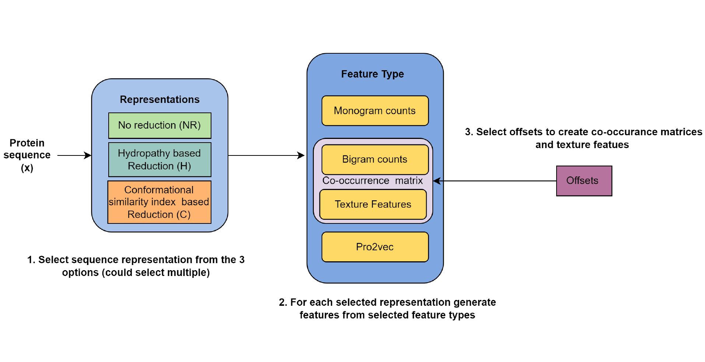

# Protein-Feature-Engineering-Framework-for-AMPylation-Site-Prediction

## Dataset 

The data that support this study is available at https://github.com/MehediAzim/DeepAmp. It has been converted in csv format and present in the dataset folder.

Dataset also includes protein sequence embeddings for i. regular protein alphabet sequences (ProtVec) ii. reduced protein alphabet sequences (Ra2vec).

## Feature engineering

All the feature engineering methods could be found in "main.py".

## Quick setup

1. Install the required python packages : `pip install -r requirement.txt`
2. Run the script "extract_feat.py". It will create a pickle file "features_amp.pkl" 
3. Run "folds-cv.py" to perform 10 folds cross validation as given in the manuscript. It will return a csv file in results directory containing several metrics used for evaluation.

